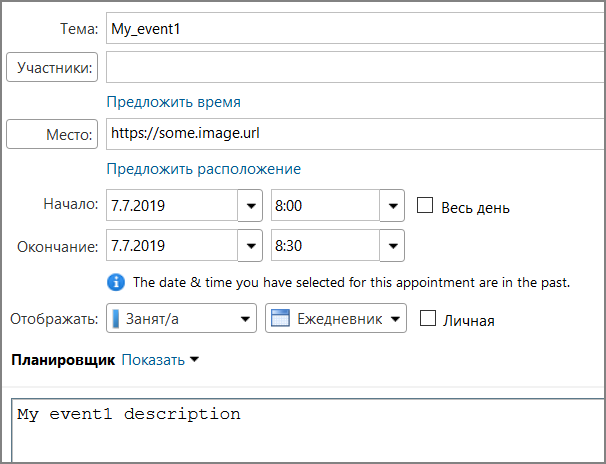

# zimbra-bot
Discord bot for Zimbra server.

## Install
* install [Node.js](https://nodejs.org/en/)
* install packages: `cd zimbra-bot && npm install`

## Run
* [create Discord bot and get a token](https://github.com/reactiflux/discord-irc/wiki/Creating-a-discord-bot-&-getting-a-token)
* create the `.env` file, and put the string `BOT_TOKEN={your token here}` into it
* run `npm start`

# Supported commands

## !zimbra help
Prints all supported commands.

## Calendar commands

Allows to watch for events of a Zimbra Calendar, and show event notifications.

## !zimbra cal help
Prints the help message on 'calendar' commands.

## !zimbra cal list
Prints all watched calendars.

## !zimbra cal watch {name} {url} {auth_token}
Add the calendar to the watch list:
* url - calendar URL
* auth_token - Zimbra auth token ([ZM_AUTH_TOKEN](https://wiki.zimbra.com/wiki/Zimbra_REST_API_Reference#Authentication))

## !zimbra cal unwatch {name}
Remove the calendar from the watch list:
* url - calendar URL

## !zimbra cal events
Prints upcoming events.

# Tuning

## `index.js`
* `const prefix = '!zimbra'` - commands prefix

## `commands/cal.js`
* `const checkDbTimeout = 10000` - timeout to check DB changes (10 sec), re-reads DB only if `env.CAL_CHANGED` var is set
* `const checkURLsTimeout = 120000` - timeout to check a calendar URL (120 sec)

## Event notifications

The simple event notification consists of:
* title
* description
* image URL

Another option is to use Discord RichEmbed object:

You can use any [embed visualizer](https://leovoel.github.io/embed-visualizer) to create a notification.
